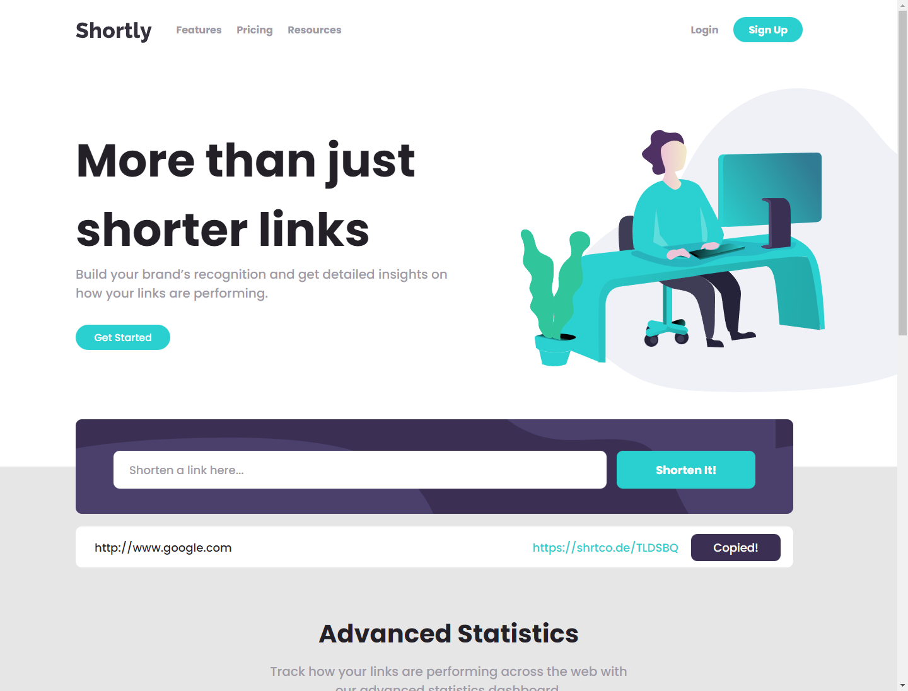

# Frontend Mentor - Shortly URL shortening API Challenge

This is a solution to the URL-Shortening API MASTER. Frontend Mentor challenges help you improve your coding skills by building realistic projects. 

## Table of contents

- [Overview](#overview)
  - [The challenge](#the-challenge)
  - [Screenshot](#screenshot)
  - [Links](#links)
- [My process](#my-process)
  - [Built with](#built-with)
  - [What I learned](#what-i-learned)
- [Author](#author)

## Overview

### The challenge

Users should be able to:

- View the optimal layout for the site depending on their device's screen size
- Shorten any valid URL
- See a list of their shortened links, even after refreshing the browser
- Copy the shortened link to their clipboard in a single click
- Receive an error message when the `form` is submitted if:
  - The `input` field is empty

### Screenshot

### Links

- Solution URL: [Github](https://github.com/MagicAces/url-shortening)
- Live Site URL: [Cyclic]()

## My process

### Built with

- Semantic HTML5 markup
- CSS custom properties
- Flexbox and CSS Grid

### What I learned

I used Express on Nodejs blended with EJS for a bit of backend. It was also an opportunity to learn Async and Await, as well as, using the Clipboard API.

## Author

- Frontend Mentor - [@MagicAces](https://www.frontendmentor.io/profile/MagicAces)
- Twitter - [@IsaacOniti](https://www.twitter.com/IsaacOniti)

